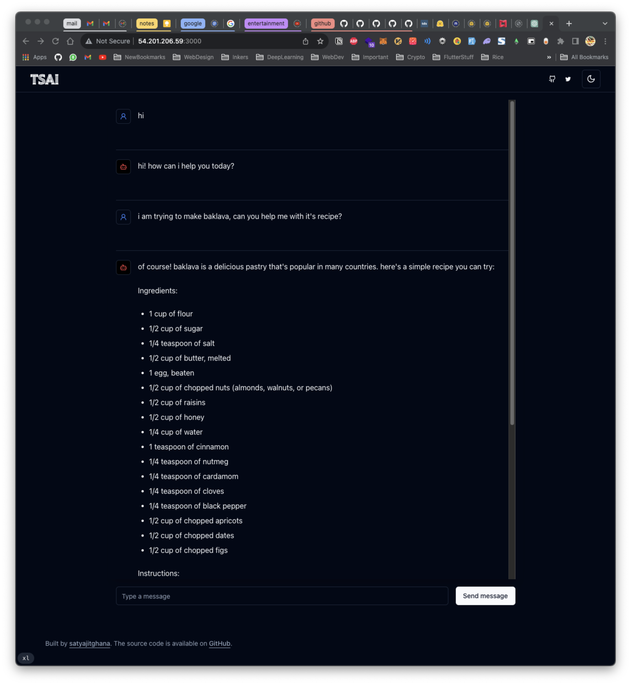
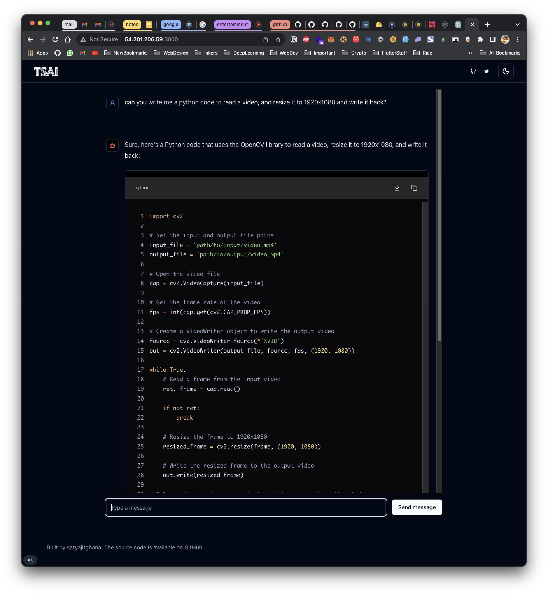

# Next JS - OpenAI Chat UI - `llama.cpp`

This is a simple chat ui, that makes use OpenAI Chat Completions API, also can be used with `llama.cpp` server

## Backend

Helper Script

```
bash -c "$(curl -s https://ggml.ai/server-llm.sh)"
```

Or do manually

```
git clone https://github.com/ggerganov/llama.cpp
cd llama.cpp
make -j
wget "https://huggingface.co/TheBloke/Mistral-7B-Instruct-v0.1-GGUF/resolve/main/mistral-7b-instruct-v0.1.Q8_0.gguf?download=true" -O mistral-7b-instruct-v0.1.Q8_0.gguf
./server -m ./mistral-7b-instruct-v0.1.Q8_0.gguf -c 2048 --host 0.0.0.0
```

## Frontend

Install dependencies

```
npm install
```

Modify the model backend url to point to either OpenAI API, or `llama.cpp` Server you created above

`site.ts`

```
  modelBackend: "https://rnfwd-49-207-249-85.a.free.pinggy.online/v1",
```

Run the frontend

```
npm run dev
```

NOTE: The frontend code is inspired from the `ai` sdk by vercel! although mostly its `shadcn/ui` components and tailwind that makes it look good

# UI




